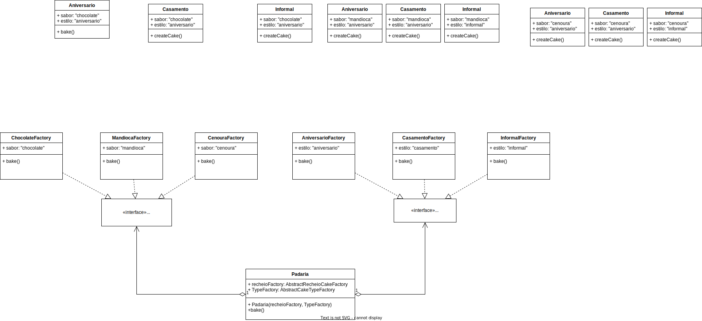

# lab03

## Abstract Factory Padaria

### Identificação das Classes
Vamos implementar a abstract Factory da padaria, inicialmente identifica-se a matriz de tipos de produtos versus variantes do produto. Neste caso assumisse que os produtos sãos os tipos de bolo, e a variante são os sabores, como resultado temos o nome do bolo que representa o bolo gerado:

<center>

| Sabores   |     Anivesário    |       Casamento      |         Informal       |
| :-------: | :---------------: | :------------------: | :--------------------: |
| Chocolate | Choco de Niver    | Gateau au chocolat   | bento cake de choco    |
| Mandioca  | Mandioca de Niver | Gateau au Manioc     | bento cake de mandioca |
| Cenoura   | Cenoura de Niver  | Gateau aux Carrottes | bento cake de cenoura  |

</center>

### Diagrama de classes
O diagrama de classes para o sistema da padaria está descrito abaixo

<!--  -->

### Exemplo de caso
Para uma main descrita abaixo:

```
if __name__ == '__main__':
    
    padariaChoco = Padaria('chocolate')
    padariaMadioca = Padaria('Mandioca')
    padariaCenoura = Padaria('Cenoura')

    ## Região dos bolos de aniversário
    print('Bolos de Aniversário')
    print('---------------------------------------')
    b1 = padariaChoco.getFactory().bakeAniversario()
    print('o Bolo Cholate')
    b1.soprarVelas()
    b1.comer()
    
    print('')
    b2 = padariaMadioca.getFactory().bakeAniversario()
    print('o Bolo de Mandioca')
    b2.soprarVelas()
    b2.comer()

    print('')
    b3 = padariaCenoura.getFactory().bakeAniversario()
    print('o Bolo de Cenoura')
    b3.soprarVelas()
    b3.comer()

    print('\n')
    ## Região dos bolos de aniversário
    print('Bolos de Casamento')
    print('---------------------------------------')
    b1 = padariaChoco.getFactory().bakeCasamento()
    print('o Bolo Cholate')
    b1.cortarBolo()
    b1.comer()
    
    print('')
    b2 = padariaMadioca.getFactory().bakeCasamento()
    print('o Bolo de Mandioca')
    b2.cortarBolo()
    b2.comer()

    print('')
    b3 = padariaCenoura.getFactory().bakeCasamento()
    print('o Bolo de Cenoura')
    b3.cortarBolo()
    b3.comer()

    print('\n')
    ## Região dos bolos de aniversário
    print('Bolos Informais')
    print('---------------------------------------')
    b1 = padariaChoco.getFactory().bakeCasamento()
    print('o Bolo Cholate')
    b1.comer()
    
    print('')
    b2 = padariaMadioca.getFactory().bakeCasamento()
    print('o Bolo de Mandioca')
    b2.comer()

    print('')
    b3 = padariaCenoura.getFactory().bakeCasamento()
    print('o Bolo de Cenoura')
    b3.comer()
```

Temos o output esperado a seguir:

``` 
Bolos de Aniversário
---------------------------------------
o Bolo Cholate
Parabéns por mais um ano de vida com seu Choco de Niver
Niver de Choco, que Delicia!

o Bolo de Mandioca
Parabéns por mais um ano de vida com seu Cenoura de Niver
Cenoura de Niver, para quem gosta de clássicos!

o Bolo de Cenoura
Parabéns por mais um ano de vida com seu Cenoura de Niver
Cenoura de Niver, para quem gosta de clássicos!


Bolos de Casamento
---------------------------------------
o Bolo Cholate
Felicitações pelo casamento, que seja tão bom quanto um Gateau au Chocolat!
Refinado e elegante, Gateau au Chocolat!

o Bolo de Mandioca
Felicitações pelo casamento, que seja tão bom quanto um Gateau aux Carrottes!
Tradicional e Inesperado, Gateau aux Carrottes!

o Bolo de Cenoura
Felicitações pelo casamento, que seja tão bom quanto um Gateau aux Carrottes!
Tradicional e Inesperado, Gateau aux Carrottes!


Bolos Informais
---------------------------------------
o Bolo Cholate
Refinado e elegante, Gateau au Chocolat!

o Bolo de Mandioca
Tradicional e Inesperado, Gateau aux Carrottes!

o Bolo de Cenoura
Tradicional e Inesperado, Gateau aux Carrottes!
```

## Builder Padaria

<!-- 
 -->
